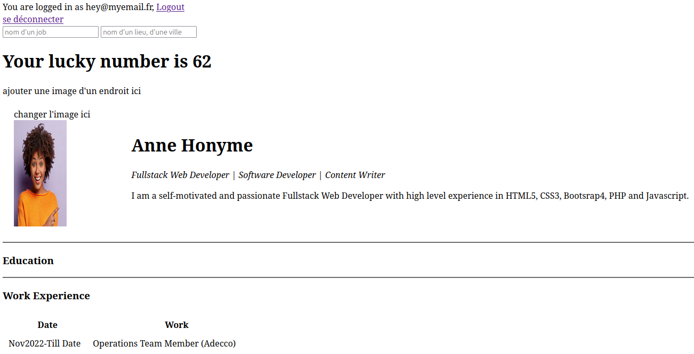

- application pour programmer PHP/pour creer un compte dans un reseau avec des langages informatique  avec ses infos, et chercher un job comme technicien informatique dans sa region
dans .env on peut modifier base donee

- faire:
- php --ini
- Loaded Configuration File:         /etc/php/8.3/cli/php.ini
- uncomment "extension=pgsql"


- apt-get install php libapache2-mod-php
- psql -h localhost -U postgres -p 5432

- CREATE FOREIGN DATA WRAPPER bidon;
- CREATE SERVER monserveur FOREIGN DATA WRAPPER bidon OPTIONS (host 'localhost', dbname 'trucsdb', port '5432');
- $ su - postgres 
- $ psql template1
- template1=# CREATE USER tester WITH PASSWORD 'test_password';
- template1=# GRANT ALL PRIVILEGES ON DATABASE "test_database" to tester;
- template1=# \q

- DATABASE_URL=postgres://{user}:{password}@{hostname}:{port}/{database-name}
# turbo-it-job
````
cd my_project/
php -S localhost:8000 -t public/
````

